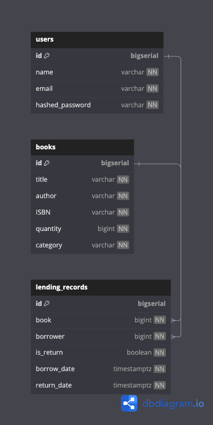
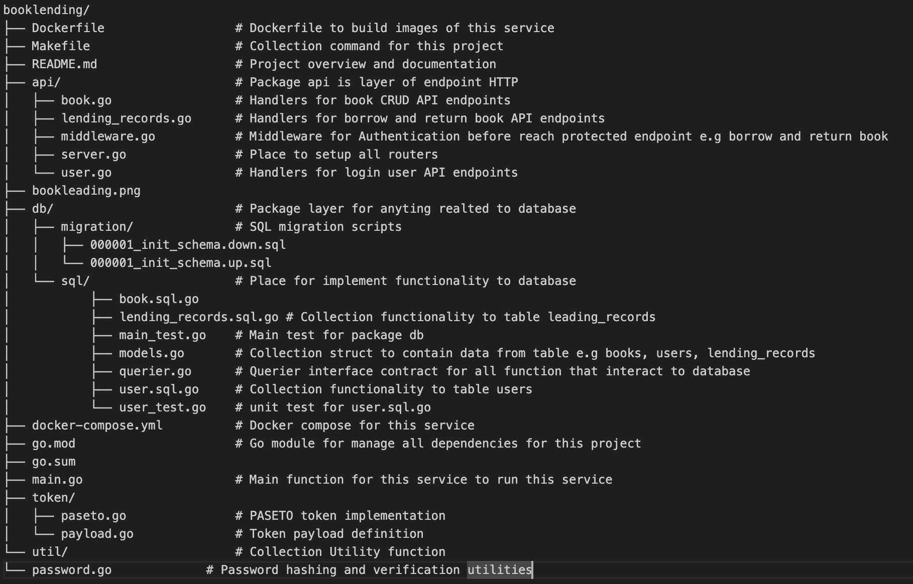

# BOOKLENDING

App untuk pinjam buku.

## Dokumentasi API

Untuk detail lengkap mengenai API proyek ini, termasuk endpoint, parameter, dan contoh respons, silakan kunjungi dokumentasi API kami:

**[Lihat Dokumentasi API Lengkap di Postman Documenter](https://documenter.getpostman.com/view/17086351/2sB2xCiVCB)**

Atau Anda bisa langsung mengaksesnya di: `https://documenter.getpostman.com/view/17086351/2sB2xCiVCB`

---

## Setup Instruction
Run Following command :
### Install Mysql
$ make install-mysql
### Install golang-migrate
$ make install-migrate
### Run Migration
$ make migrate-up

### Run the Go application
$ go run main.go

---

## Table Schema

---

## Project Structure

## Major Technical Decision

### PASETO token insted JWT token
PASETO is safeties and easy to use then JWT, becasue JWT give developer so much options and way to implement token that 
often lead developer that not really familiar with security to make mistake and vulnerable security issue.

### Store HashedPassword insted Naked Password
This is best practice to always store password in hashed form insted naked password for security reason

### Using Viper for config app
This is best practice to place any configuration (e.g secretkey or any credential) to separate file instead hardcode

### Dockerfile with 2 stage
Build docker image with 2 stage for make lightwage docker image, stage 1 for build golang executable app and 
stage 2 copy executable file from builder to run in lightwage os like linux alphine

---

## Place To Improve

### ***Implement database transaction for reliable and consistency data

---

## Provided Data for Test
### Data for table books
INSERT INTO books (title, author, ISBN, quantity, category) VALUES
("The Go Programming Language", "Alan A. A. Donovan, Brian W. Kernighan", "978-0134190440", 5, "Programming"),
("Clean Code", "Robert C. Martin", "978-0132350884", 10, "Software Engineering"),
("The Hitchhiker's Guide to the Galaxy", "Douglas Adams", "978-0345391803", 3, "Science Fiction"),
("Sapiens: A Brief History of Humankind", "Yuval Noah Harari", "978-0062316097", 7, "History"),
("The Lord of the Rings", "J.R.R. Tolkien", "978-0618053267", 6, "Fantasy"),
("Educated", "Tara Westover", "978-0399590504", 4, "Memoir"),
("Thinking, Fast and Slow", "Daniel Kahneman", "978-0374533557", 8, "Psychology"),
("The Da Vinci Code", "Dan Brown", "978-0307474278", 12, "Thriller"),
("Becoming", "Michelle Obama", "978-1524763138", 2, "Biography"),
("Project Hail Mary", "Andy Weir", "978-0593135204", 9, "Science Fiction"),
("Atomic Habits", "James Clear", "978-0735211292", 15, "Self-Help"),
("Where the Crawdads Sing", "Delia Owens", "978-0735219090", 7, "Mystery"),
("Dune", "Frank Herbert", "978-0441172719", 6, "Science Fiction"),
("The Midnight Library", "Matt Haig", "978-0525559474", 4, "Fiction"),
("The Alchemist", "Paulo Coelho", "978-0061122415", 11, "Philosophical Fiction");

### Data for table users
#### *** NOTE: password for all email are "password"
INSERT INTO users (name, email, hashed_password) VALUES
("secrho", "secrho@gmail.com", "$2a$10$0m3AblmIZS/1npJh7wtUVOlFfHwKb.sHF2PLGmii45HfJdRHjr71i"),
("oggihn", "oggihn@gmail.com", "$2a$10$MEkWekNeUxTSWJ.XhDS.ieRVnIGS/jup0.ZHSvDrh/63fwzPXTlPK"),
("krcehu", "krcehu@gmail.com", "$2a$10$9ZHAeGI8cROrXemADj4vrecR.CDLMCpTA6RcnplW2Y7xCsDqdwi/q"),
("xfypae", "xfypae@gmail.com", "$2a$10$ORiEkRw/Jit9w9cY1/yD0e23gfyO3JkWaH3pxse8Cu2Rc9C.j/yhu"),
("lkhrjs", "lkhrjs@gmail.com", "$2a$10$LxFTEqbK7HjpjqDvngjbN.M5EDB9watb1KZuxqk3ATKKxEp6I9zCW"),
("dtvljl", "dtvljl@gmail.com", "$2a$10$4DQCJa/9v.SFaGJS0qcxr.H05z9mLedKRa3h5ufEos/3DjsCmUAmS"),
("yeiqwy", "yeiqwy@gmail.com", "$2a$10$0nHfGimPKp/5Eu8ipNyO1Ouz7.QL0HxXi7c4XXhgpTHtKU7kEy6S6"),
("ivxvod", "ivxvod@gmail.com", "$2a$10$zKKVIO1iZHhwtXgr5.GcX.LAGs.JDPnkVTrB585u3BO9E9Ibqtsyi"),
("hbdkcb", "hbdkcb@gmail.com", "$2a$10$yYtlAqvLkKfYpVGQJpb9muAQsbXEgoHvA5KosAjB0MVXYuyOHSGDe"),
("ebwcyw", "ebwcyw@gmail.com", "$2a$10$EjOEuE0iSirN4L4lIyBE7.8fANOEMk3k9e5FHMxBrywxx96BklnxG"),
("knmbnh", "knmbnh@gmail.com", "$2a$10$TeDUjAKoJDClXxO3Zaw6uOtu0lnyvmxa8ZFoHlQGdg4iW0t6m6eHm"),
("yjjrtg", "yjjrtg@gmail.com", "$2a$10$gQkCFWpUuJqDT2x9/IqRK.cGiq4hmnoEmkuYlNICLNo6OY6T1E5Tq"),
("dirfks", "dirfks@gmail.com", "$2a$10$/k/IyC5rkgcCwYSKherb0.mVWtZep7Hbb6/qJBsJo/UT3QZXeFsyC"),
("xdgmeg", "xdgmeg@gmail.com", "$2a$10$2Dx8njQo.i8DJPLKmq05IugbEAwA7lbD2FtlktZcgOCtIqfW.nal2"),
("ehzsrs", "ehzsrs@gmail.com", "$2a$10$G9ZniPn4irjDKgejd7.XMuqdUfstu1N7i/ePzyALy6ZPO4aWrZbyW"),
("ugtrba", "ugtrba@gmail.com", "$2a$10$FrsMGMl.flGxsoyBOFl4QeOkQzFG6ClRSJgGSY0WlSgJEIB9xSmM."),
("gnklfv", "gnklfv@gmail.com", "$2a$10$DrOZXCwMev7xd9u4tO3ECO7loS5emRQ3Bv/kV.eg8S/3l7hyWcuxi"),
("rhjaym", "rhjaym@gmail.com", "$2a$10$nTrRoB1Gb47OkcB.BlRHOe9iBBk2rQjA/7Q62MfAXCaYnf6/0GJu2"),
("vzxwcs", "vzxwcs@gmail.com", "$2a$10$3xAOYWYRMqPrqQc5FEr7Y.p/ZvLHqSX1UCscTPwm38eK7r41ym1Rm"),
("agmkul", "agmkul@gmail.com", "$2a$10$J9DMtj9mvrAqq6lmAK.yPOxmdKvJU4UYtvM4SN.K2frQDWB/zlSJu"),
("ustgcg", "ustgcg@gmail.com", "$2a$10$eX08GtsI8cKARCyraxgKyOwC9BIPSZD.yzUQXC/fIQo8c4SFCMuvq"),
("jkdqeq", "jkdqeq@gmail.com", "$2a$10$g.pSsUpIZJrWcz1CkJ.ayO8DCgdJE8f1ytON20aTV7xmII1Ll/5na"),
("zpprjc", "zpprjc@gmail.com", "$2a$10$0/qWk/Eb3CbnqLzQK362Oudl9pFuN8Ejb1JbP/0iXejbjFEWADje6"),
("wzdhhu", "wzdhhu@gmail.com", "$2a$10$DsZfUQiFyzxY32Gd/C2rv.ZJiZeV2nBtlFQ/uSggO8.TciDnIgij2"),
("cmlerp", "cmlerp@gmail.com", "$2a$10$N3g8r5RAOYJ4EUaeWprP4eokLtvlQRixb/CY01v3IcXlvmtvWdUAa"),
("emabnr", "emabnr@gmail.com", "$2a$10$buTocKovIzsEgy1XC0g8Qe0VUaCYUjtiwPshUbazI6C2XDllraBa2"),
("nywfzv", "nywfzv@gmail.com", "$2a$10$weNL0N3QFCpjc9gErOnWUuJ4pTJvT5HO9A1px.dNpvOjOUmEzr1sW");